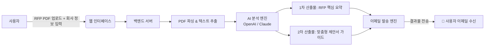

# 📋 Proposal-overview (RFP 맞춤형 요약 & 제안서 작성 가이드 서비스)

> **지원사업 및 공공/민간 입찰에 도전하는 초기 스타트업 대표를 위한 AI 기반 RFP 분석 및 맞춤형 제안서 작성 지원 솔루션**

---

## 💡 프로젝트 소개

초기 스타트업은 수십~수백 페이지에 달하는 RFP(제안요청서)를 분석하고 맞춤형 제안서를 기획하는 데 많은 시간과 리소스를 소모합니다.  
**Proposal-overview**는 RFP PDF를 업로드하고 간단한 기업 정보를 입력하면, AI가 핵심 요구사항을 1~2페이지로 압축 분석하고 기업 역량에 최적화된 **제안서 목차 및 전략 가이드**를 생성하여 이메일로 전달하는 원스톱 서비스입니다.

---

## 🎯 핵심 기능

1. **📄 RFP PDF 자동 파싱 & 구조화 분석**
   - 수십 페이지 분량의 RFP에서 핵심 요구사항, 평가 기준 및 배점, 제출 마감일, 필수 자격 요건 자동 추출

2. **⚡ 1~2페이지 핵심 요약 보고서 (1차 산출물)**
   - 바쁜 대표자 및 실무자를 위해 핵심 내용만 1~2페이지 분량으로 일목요연하게 압축 요약

3. **🎯 맞춤형 제안서 작성 가이드라인 (2차 산출물)**
   - 입력된 회사 정보(업종, 역량, 실적 등)와 RFP 요구사항을 결합하여 최적화된 제안서 목차 및 항목별 강조 전략 제시

4. **📧 이메일 즉시 전송**
   - 분석 완료된 요약 보고서 및 가이드를 사용자의 이메일로 깔끔한 템플릿 형태로 즉시 전달

---

## 🔄 서비스 흐름 (Workflow)



---

## 🛠️ 기술 스택 (예정)

- **Frontend / Backend**: Next.js (App Router), TypeScript, Tailwind CSS
- **AI Engine**: OpenAI API (GPT-4o) / Claude API
- **PDF Processing**: `pdf-parse` / `pdfjs-dist`
- **Email Delivery**: Resend / Nodemailer / SendGrid
- **Database / Auth**: Supabase (PostgreSQL, Storage, Auth)

---

## 📁 디렉토리 구조

```
Proposal-overview/
├── AGENTS.md                  # 프로젝트 총괄 지침서
├── TASK_STATUS.md             # 작업 진행 상태 및 태스크 추적
├── README.md                  # 프로젝트 안내서 (본 파일)
├── .gitignore                 # Git 제외 파일 목록
├── .env.example               # 환경변수 템플릿
└── src/                       # 애플리케이션 소스 코드 (예정)
```

---

## 🚀 빠른 시작 가이드 (Local Setup)

### 1. 레포지토리 클론
```bash
git clone https://github.com/rellion48-crypto/proposal-overview.git
cd proposal-overview
```

### 2. 환경변수 설정
`.env.example` 파일을 복사하여 `.env` 파일을 생성하고 필요한 키 값을 입력합니다.
```bash
cp .env.example .env
```

---

## 📌 규칙 & 운영

- **프로젝트 지침**: [AGENTS.md](AGENTS.md) 참조
- **태스크 진행 현황**: [TASK_STATUS.md](TASK_STATUS.md) 참조
- **커밋 메시지 규칙**: 모든 커밋 메시지는 **한국어**로 작성합니다.
